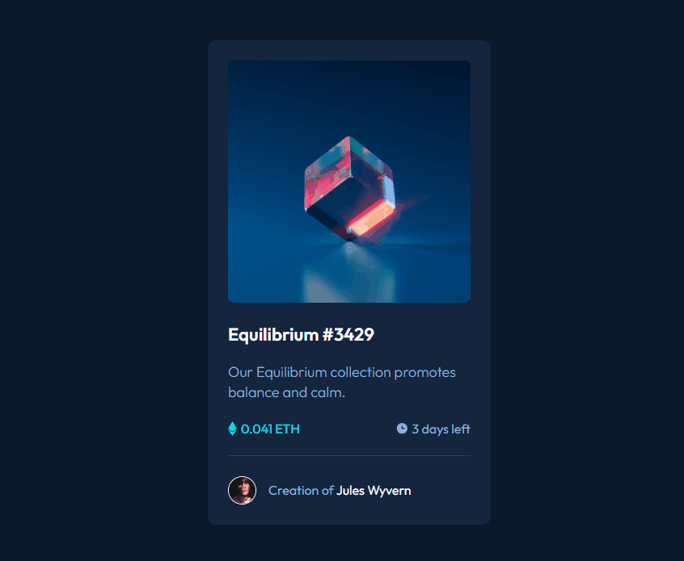
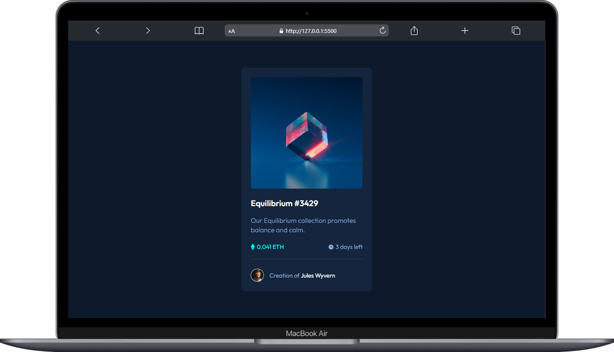
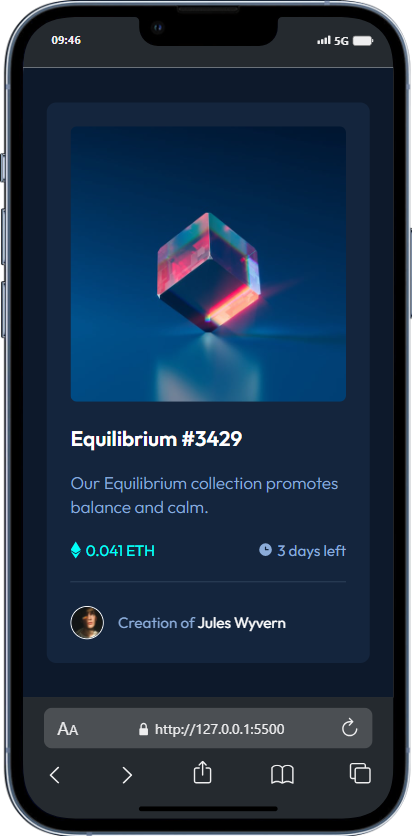

#  Cartão de Visualização NFT 💻

## Visão Geral 🚀
 Este projeto foi concebido durante um workshop empolgante realizado no curso DeveQuest / Devemdobro. Esta experiência foi um marco significativo, permitindo a aplicação prática de diversos conhecimentos adquiridos até o momento em HTML e CSS.
  O exercício foi proposto pelo Frontend Mentor, proporcionando a oportunidade de aplicar os conhecimentos adquiridos de forma prática. 👩‍💻

## Objetivo 🎯
O cartão de visualização NFT desenvolvido neste projeto busca oferecer uma representação visual elegante e informativa (NFTs). Durante o processo de criação, exploramos conceitos avançados de usabilidade para oferecer uma experiência envolvente aos usuários. 🎨

## Aprendizados 💻🚀
Durante o workshop, aprimorei minhas habilidades técnicas e criativas, compreendendo melhor a importância de uma estrutura bem definida em HTML e a estilização aprimorada por meio do CSS. Além disso, aprendi como integrar efetivamente esses dois elementos para criar uma experiência de usuário mais dinâmica e esteticamente agradável.

## Preview Gif 🎥
Implementação de um efeito hover interativo na imagem e no nome, aprimorando a interatividade e proporcionando feedback visual imersivo aos usuários.

## Preview Desktop 🖥️ 📸
Visualize o Card Component em todo o seu desktop!

## Preview Mobile 📱 📸
Desfrute da experiência responsiva do Card Component em dispositivos móveis.

## Personalização 🎨
Sinta-se à vontade para Você modificar o Card Component , adicionar mais funcionalidades ou integrá-lo a outras tecnologias.

## Tecnologias Utilizadas  💻

## Contribuição 🤝
Contribuições são bem-vindas! Sinta-se à vontade para propor melhorias, correções de bugs ou novos recursos. 🚀

## Agradecimentos 🙌

Gostaria de expressar minha profunda gratidão pela oportunidade de participar do workshop no curso DeveQuest / Dev em Dobro. Este projeto NFT foi possível graças ao conhecimento adquirido durante esse período, e estou imensamente grato por essa experiência enriquecedora. Obrigado pela inspiração, aprendizado e apoio contínuo.
Agradecemos também ao Frontend Mentor por disponibilizar desafios práticos que impulsionam o aprendizado e a aplicação de conceitos fundamentais no desenvolvimento web.

### Agradeço por conferir meu projeto! Espero que este exercício tenha sido tão emocionante para você quanto foi para mim. Se tiver dúvidas ou sugestões, sinta-se à vontade para entrar em contato.

#### Divirta-se codificando! 😊 

## Contato 📲

### me segue nas redes abaixo!
 

   
  
  
  

